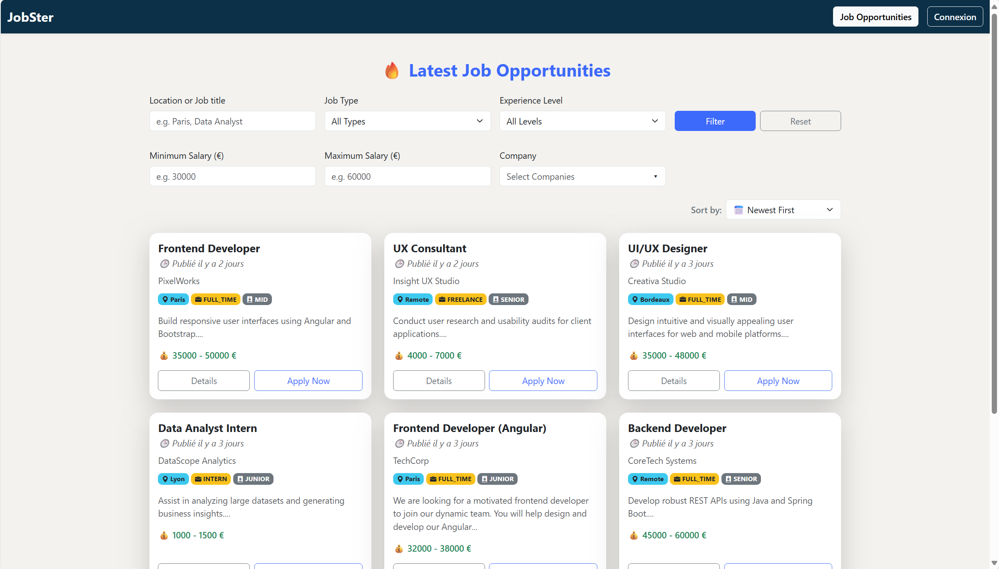
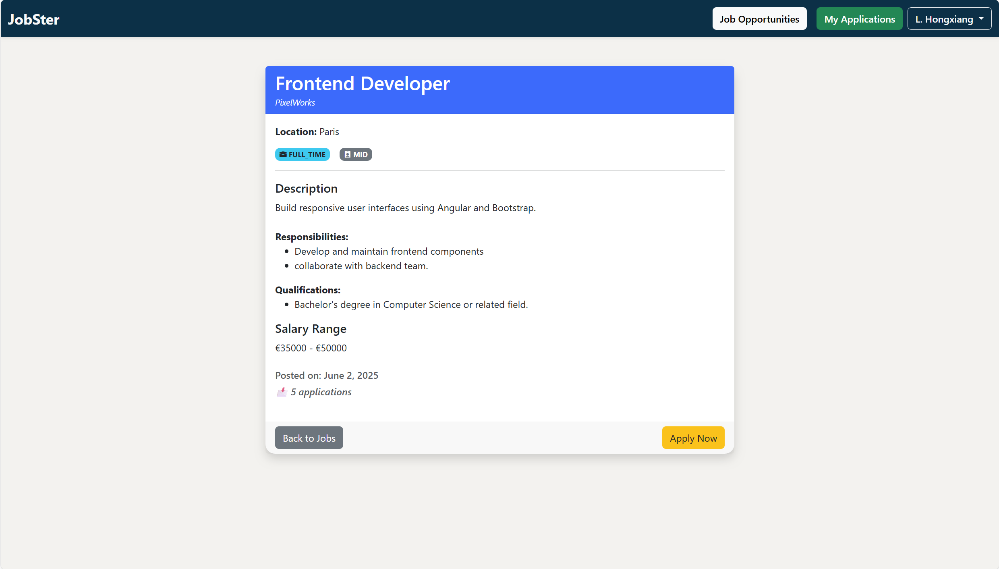
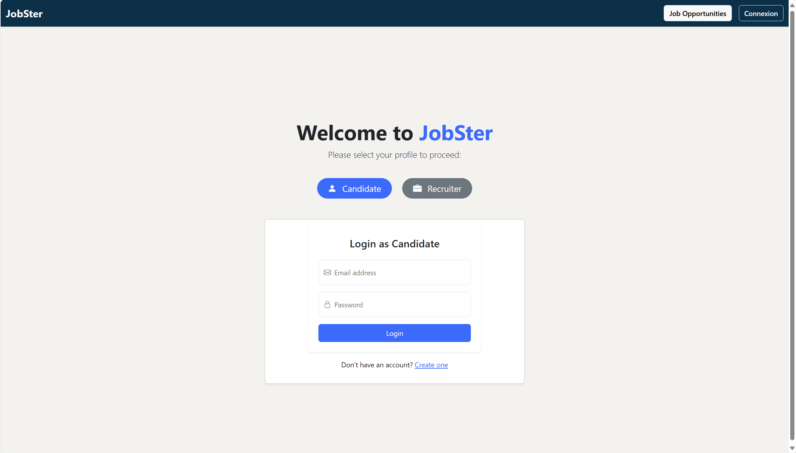
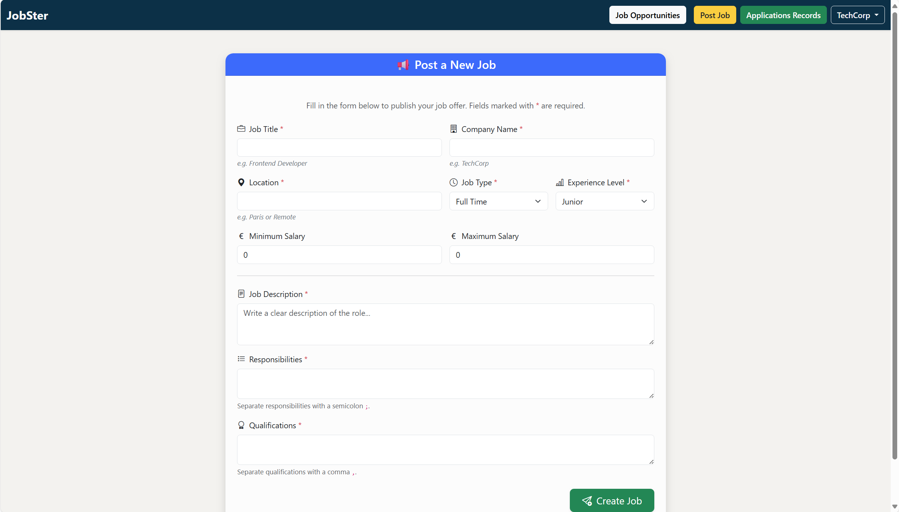

# 💼 Job Portal

A modern and responsive job application platform built with **Angular**, **Spring Boot**, and **PostgreSQL**.  
This platform allows recruiters to post jobs and track applications, while enabling candidates to explore and apply for job opportunities with ease.

---

## 🚀 Features

### 🔍 1. Job Listing & Search
Users can browse and filter job offers using advanced criteria:
- Keywords (location, job title)
- Job Type (Full-Time, Internship, etc.)
- Experience Level
- Salary Range
- Company



---

### 📄 2. Job Details
Clicking "Details" shows complete job info including:
- Description
- Responsibilities
- Qualifications
- Salary
- Post date and number of applications



---

### 🧑‍💻 3. Candidate & Recruiter Login
Role-based login interface to switch between candidate and recruiter profiles.



---

### 📝 4. Application Form
Candidates can apply to jobs by filling in:
- Personal Info (name, email, phone)
- Skills and Experiences
- Uploading CV and Cover Letter


---

### 📢 5. Post a New Job
Recruiters can post job listings with all essential info:
- Job type, experience level, salary
- Responsibilities and qualifications



---

### 📂 6. Application Records (Admin View)
Recruiters can view detailed applications per job, including candidate profiles, skills, and experience timelines.


---

## ⚙️ Tech Stack

| Layer        | Technology        |
|--------------|-------------------|
| Frontend     | Angular, Bootstrap |
| Backend      | Spring Boot 3.4.x |
| Database     | PostgreSQL (via Supabase) |
| Versioning   | Git & GitHub       |

---

## 🗂 Project Structure

```text
job-portal/
├── backend/         # Spring Boot backend
├── frontend/        # Angular frontend
├── README.md
└── screenshots/     # UI images for documentation
