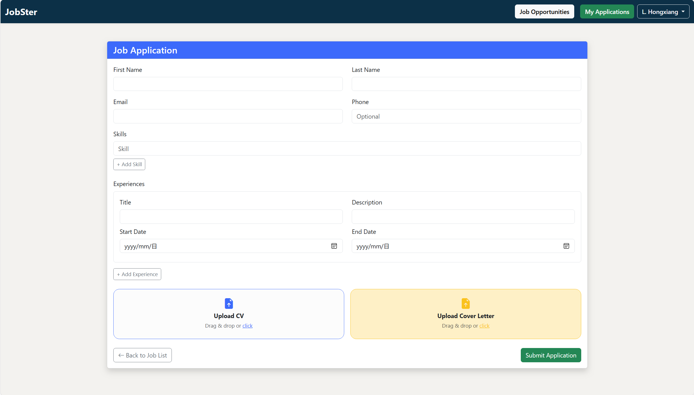

# 💼 JobSter

**JobSter** is a modern web platform built for connecting job seekers and recruiters. Designed with a sleek interface and practical features, it simplifies the job application and hiring process.

---

## 🔍 Features Overview

### 1. Browse & Filter Jobs
Search by location, type, salary, experience level, and company.

---

### 2. Candidate & Recruiter Login
Separate login experiences for candidates and recruiters.

---

### 3. Candidate Registration
Register and create a full profile with contact, address, and preferences.

---

### 4. Job Details
Click into any job to view detailed description, requirements, and salary.

---

### 5. Apply to a Job
Fill out the application form, list skills and experience, and upload documents.

---

### 6. Confirmation Modal
Receive a clear submission success message.

---

### 7. Application Tracking
Recruiters can review applicant details including CV and experience.

---

### 8. Post a New Job
Recruiters can publish new job listings with customizable fields.

---

### 9. Terms & Conditions Page
Well-styled and humorously written terms and conditions.

---

## 🛠 Tech Stack

| Layer       | Stack                        |
|-------------|------------------------------|
| Frontend    | Angular + TypeScript         |
| Backend     | Spring Boot (Java 23)        |
| Database    | PostgreSQL (via Supabase)    |
| UI Library  | Bootstrap + Icons            |

---

## 👥 Contributors
- Hongxiang LIN
- Liya XU

---

## 🔗 Project Links

- [Frontend GitHub Repo](https://github.com/xuliya000/job-portal-frontend)
- [Backend GitHub Repo](https://github.com/xuliya000/job-portal-backend)

> Make sure these are committed and properly referenced for GitHub rendering.
